[linkedin](https://br.linkedin.com/in/pedrozia) &nbsp;·&nbsp;
[instagram](https://www.instagram.com/pedropaulozia) &nbsp;·&nbsp;
[website](#) &nbsp;·&nbsp;
[email](mailto:pedropaulozia@gmail.com)

> Backends that hold up, pipelines that don't need babysitting — CI, scheduled 
> automation, and embedded when something has to talk to the real world.

I build backends in Java / Quarkus, ship them through pipelines I maintain, and 
reach for C on microcontrollers when the problem leaves the server. This profile 
is a scheduled automation in itself — every graphic here is drawn by a workflow 
from live data, not embedded from a third-party service.

**Backend**&nbsp;&nbsp;&nbsp; <samp>java &nbsp; quarkus &nbsp; hibernate &nbsp; rest apis &nbsp; python</samp> 
**Frontend**&nbsp; <samp>javascript &nbsp; html &nbsp; css &nbsp; primefaces</samp> 
**Database**&nbsp; <samp>postgresql &nbsp; sqlite &nbsp; sql</samp> 
**DevOps**&nbsp;&nbsp;&nbsp;&nbsp;<samp>docker &nbsp; git &nbsp; github actions &nbsp; gitlab ci &nbsp; linux &nbsp; wildfly</samp> 
**Embedded**&nbsp; <samp>arduino &nbsp; esp32 &nbsp; avr &nbsp; automation</samp> 
**Exploring** <samp>ai &nbsp; machine learning &nbsp; computer vision</samp>

**[contribution-snapshot](https://github.com/PedroZia/contribution-snapshot)** &nbsp;·&nbsp; <samp>github actions, yaml</samp> 
Reusable composite action — draws an SVG contribution sparkline from the 
GraphQL API. Drop it into any workflow, no third-party services.

**[your-project](#)** &nbsp;·&nbsp; <samp>stack, here</samp> 
Short description of what this project does.

**[another-project](#)** &nbsp;·&nbsp; <samp>stack, here</samp> 
Short description of what this project does.

Every graphic here is generated, not embedded from anyone else's server. 
`ascii.svg` is a photo pushed through a character ramp by 
[`scripts/make_portrait.py`](scripts/make_portrait.py); the stat graphics and 
these section headings are drawn by two scheduled actions — 
[`refresh stats`](.github/workflows/stats.yml) at 05:17 UTC and 
[`refresh activity`](.github/workflows/activity.yml) at 05:41 UTC — once a day, 
committing only what changed. The `runs.svg` badge at the top tells you whether 
they actually ran — drawn from the Actions API, not a third-party badge service.

They animate with SMIL inside the SVG, because GitHub strips scripts from 
READMEs — and since nothing loads from a third party, nothing here can 
rate-limit or go dark. The headings are SVGs for the same reason: GitHub also 
strips CSS, so an image is the only way to put this page's own typeface on them.

The typeface is [JetBrains Mono](scripts/fonts), subset to just the characters 
each graphic draws and inlined as base64. That isn't only for looks: the 
portrait's grid assumes an advance width of exactly 0.600 em, and a viewer whose 
default monospace is narrower would otherwise see it squeezed.

Three APIs feed this page — GraphQL for contributions, Events for recent 
activity, Actions for workflow status — all called from the runner with zero 
external services in the critical path. Language totals cover public 
repositories only. `year.svg` uses the portrait's character ramp: `:` `+` `#` `@`, 
quiet to loud.
